<h1 align="center">iris</h1>
<p align="center">a language implementation for PureScript</p>

---

Iris is a language implementation for PureScript, powered by an incremental, query-based build
system. Instead of a sequence of compiler phases, Iris models compilation and semantic information
as incrementally computed queries. These queries are used extensively to implement code intelligence
features in the language server.

The build system is designed with interactive editing in mind. To support this, it tracks dependencies
between inputs and queries, caches query results, deduplicates in-progress work across threads, and
supports cooperative cancellation when inputs change. Crucially, many query results are designed to
be incrementally reusable. For example, the compiler uses stable identities in lieu of source ranges 
to enable minimal recomputation across trivial formatting changes.

The language server component implements core code intelligence features such as completion, jump to
definition, hover information, find references, workspace symbol search, and diagnostics.

## Language server configuration

Run `iris lsp --stdio` to start the language server. The `lsp` subcommand is required;
`iris` alone no longer starts the server, and language-server options must follow `lsp`.
Editors that advertise the LSP `workspace.configuration` capability can provide settings in the
`iris.server` workspace configuration section. Iris requests that section for the first workspace
folder after initialization and requests it again after each
`workspace/didChangeConfiguration` notification; the notification's `settings` value is only an
invalidation signal. Each response is a complete configuration, so omitted or `null` fields inherit
from the defaults rather than from the preceding response. Invalid updates are shown in the editor
and leave the last valid configuration active. Clients without workspace-configuration support use
the defaults.

Iris prepares the Spago workspace during startup before serving analysis. It runs `spago fetch` in
the workspace root, then discovers sources from `spago.yaml` and package manifests, using the
resolution written by that fetch to select fetched `.spago` checkouts exactly. Preparation runs off
the protocol loop, so the server keeps accepting document notifications and replays them in order
once the workspace is ready. Requests made before preparation completes are rejected with
`ContentModified` and the message `Workspace is loading`, so clients that retry stale requests can
try again. If preparation fails, Iris reports the failure in the editor and does not
serve analysis from the partially installed project; correct the project (for example, by running
`spago fetch`) and restart Iris. Iris does not retry preparation automatically.

The defaults are:

```json
{
  "diagnostics": {
    "onOpen": true,
    "onSave": true,
    "onChange": false
  }
}
```

All settings are optional. Missing or `null` fields retain their defaults; `{}` and top-level
`null` also select the defaults. Unknown fields and invalid values are shown in the editor. Use the
[configuration JSON Schema](compiler-services/iris-configuration/configuration.schema.json) for editor
validation; associate it through editor settings rather than adding a `$schema` property.

Diagnostic settings control the corresponding document-event triggers, not all diagnostic publishing.

## Editor features

Iris provides code intelligence for PureScript projects through its
[VS Code extension](https://github.com/purefunctor/purescript-iris-vscode).
These recordings use the [Iris website](https://github.com/purefunctor/purescript-iris-website)
as a real-world PureScript workspace.

### Type intelligence while editing

<details>
<summary><strong>Inferred local types</strong></summary>

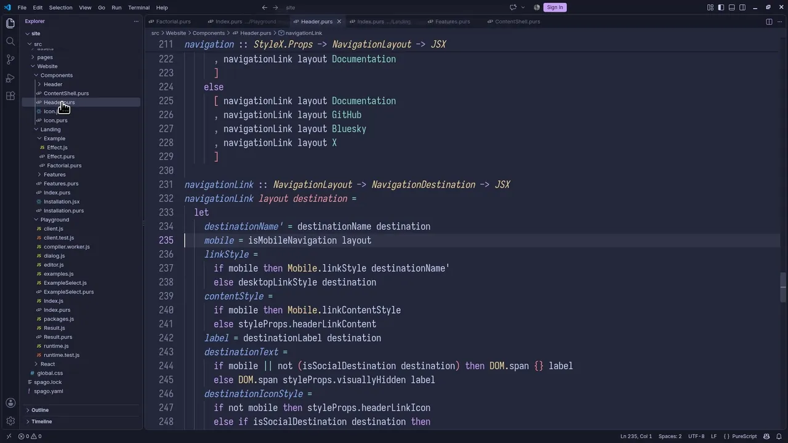

[Watch at 1080p60](.github/assets/vscode-demos/inferred-types.mp4)

</details>

<details>
<summary><strong>Scope-aware rename</strong></summary>

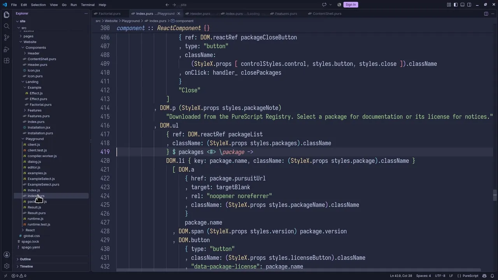

[Watch at 1080p60](.github/assets/vscode-demos/rename.mp4)

</details>

<details>
<summary><strong>Live diagnostics on unsaved edits</strong></summary>

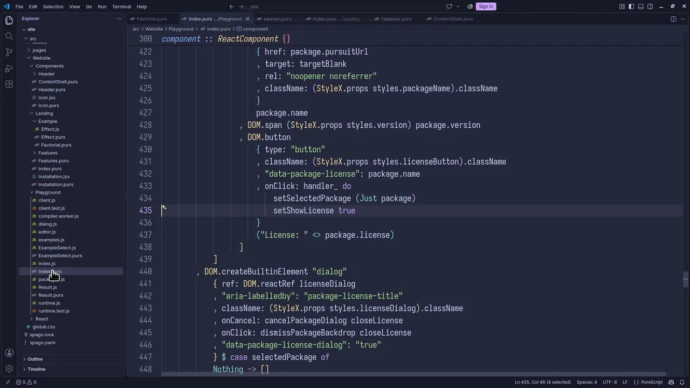

[Watch at 1080p60](.github/assets/vscode-demos/live-diagnostics.mp4)

This recording enables `iris.server.diagnostics.onChange` (off by default).

</details>

<details>
<summary><strong>Document highlights</strong></summary>

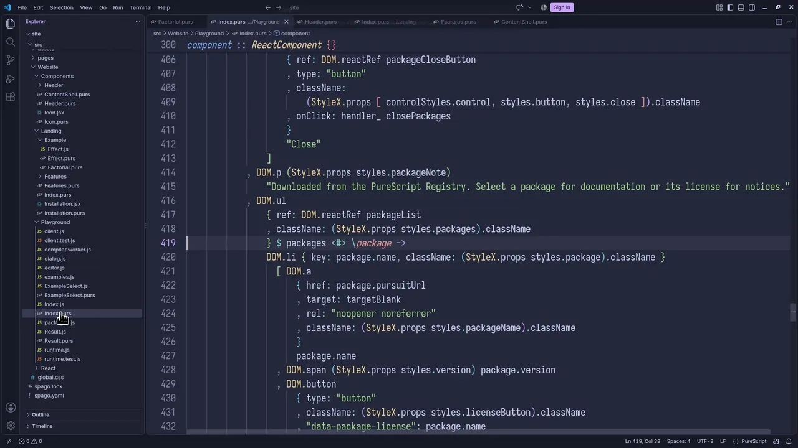

[Watch at 1080p60](.github/assets/vscode-demos/document-highlights.mp4)

</details>

<details>
<summary><strong>Semantic highlighting</strong></summary>

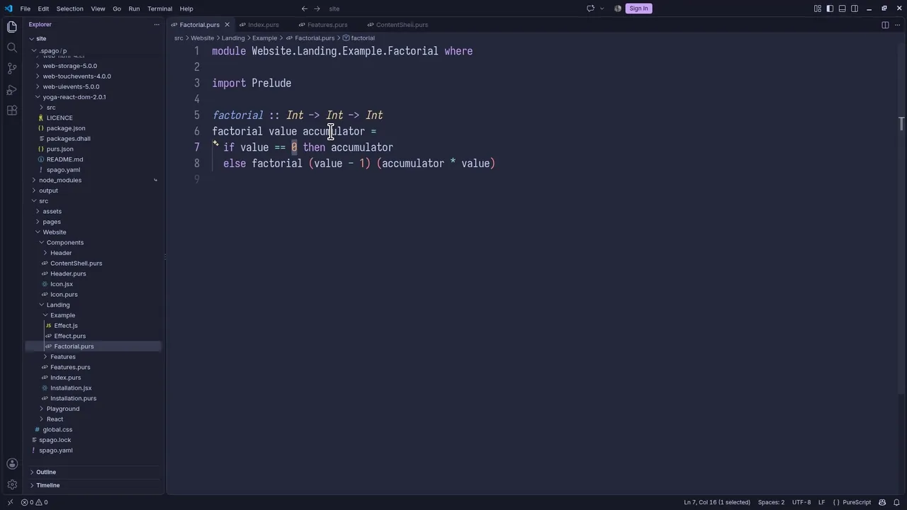

[Watch at 1080p60](.github/assets/vscode-demos/semantic-highlighting.mp4)

</details>

### Everyday editor workflows

<details>
<summary><strong>Completion</strong></summary>

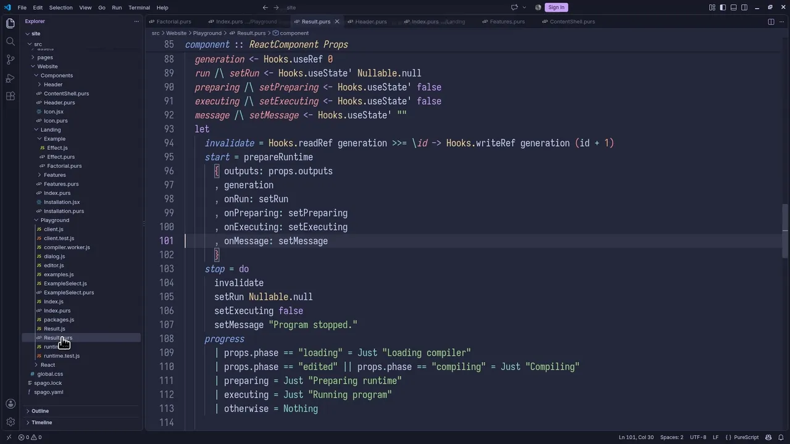

[Watch at 1080p60](.github/assets/vscode-demos/completion.mp4)

</details>

<details>
<summary><strong>Typed-hole suggestions</strong></summary>

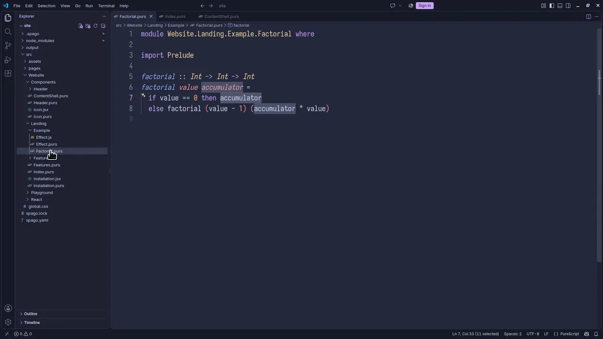

[Watch at 1080p60](.github/assets/vscode-demos/typed-hole-suggestions.mp4)

</details>

<details>
<summary><strong>Automatic imports</strong></summary>

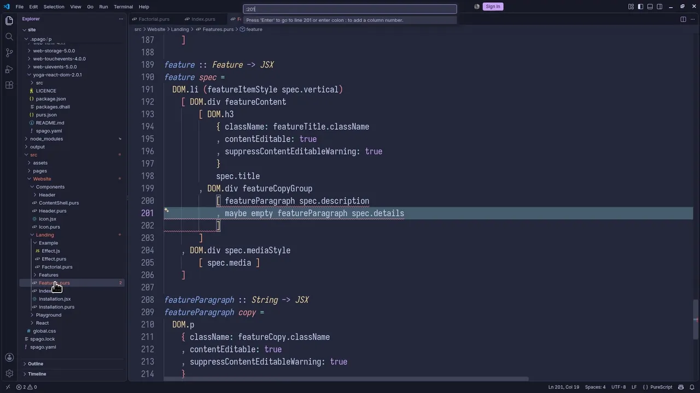

[Watch at 1080p60](.github/assets/vscode-demos/automatic-import.mp4)

</details>

<details>
<summary><strong>Go to definition</strong></summary>

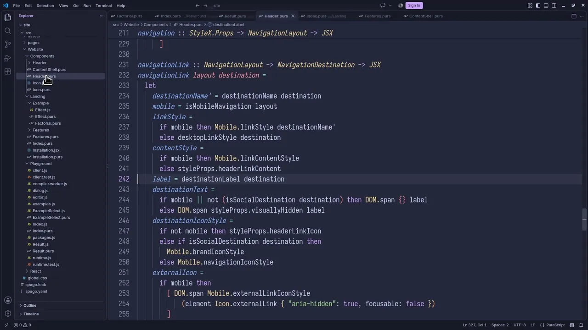

[Watch at 1080p60](.github/assets/vscode-demos/go-to-definition.mp4)

</details>

<details>
<summary><strong>Find references</strong></summary>

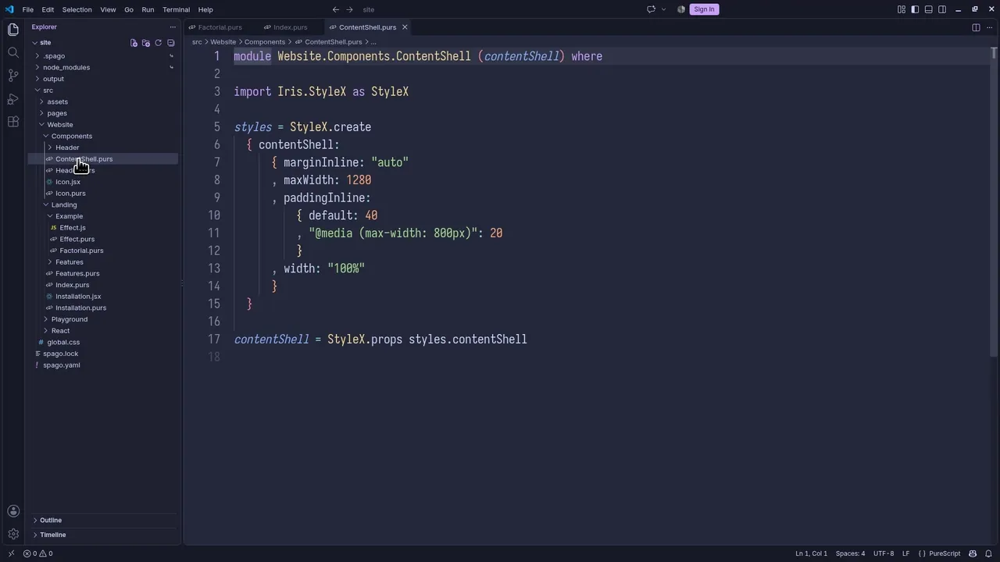

[Watch at 1080p60](.github/assets/vscode-demos/find-references.mp4)

</details>

<details>
<summary><strong>Document symbols</strong></summary>

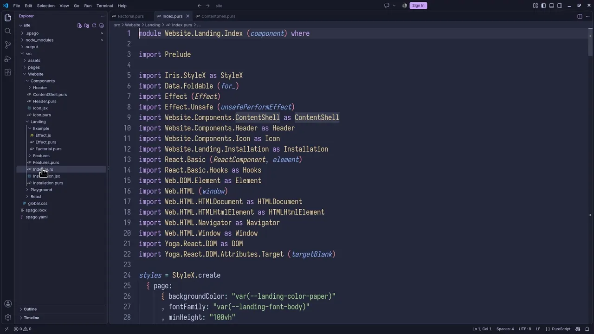

[Watch at 1080p60](.github/assets/vscode-demos/document-symbols.mp4)

</details>

<details>
<summary><strong>Workspace symbols</strong></summary>

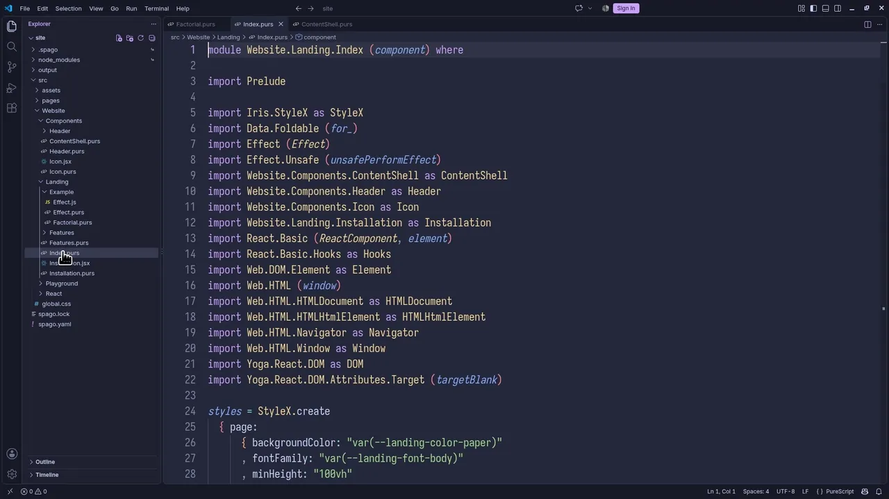

[Watch at 1080p60](.github/assets/vscode-demos/workspace-symbols.mp4)

</details>

## Installation

On Linux and macOS:

```sh
curl --proto '=https' --tlsv1.2 -LsSf \
  https://raw.githubusercontent.com/purefunctor/purescript-iris/main/install.sh | sh
```

On Windows PowerShell:

```powershell
irm https://raw.githubusercontent.com/purefunctor/purescript-iris/main/install.ps1 | iex
```

The installers verify the release's GitHub build-provenance attestation when
[GitHub CLI](https://cli.github.com/) is available. They display a warning and continue when it is not
installed. These installers require v0.1.0 or later; to install v0.0.x, use the installer from that
release's Git tag. Set `IRIS_VERSION` to a release tag or
`IRIS_INSTALL_DIR` to an installation directory to override the defaults. Set
`IRIS_SKIP_ATTESTATION=1` to skip verification explicitly (for example, when `gh` is installed but
cannot access attestations); this reduces provenance assurance and prints a warning. On PowerShell,
set `$env:IRIS_SKIP_ATTESTATION = "1"` before running the installer.

Successful builds of the `main` branch are published as GitHub prereleases tagged
`v<version>-dev.<revision>`. Consumers testing against the canary channel should resolve the newest
published, non-draft prerelease and pass its exact tag through `IRIS_VERSION`. Stable installations
continue to use GitHub's latest release.

Iris keeps its package version separate from source provenance. Packagers can set
`IRIS_BUILD_REVISION` to a Git revision when invoking Cargo to include that revision in the reported
CLI and language-server versions. The value is read at compile time; builds that omit it report the
version from `compiler-executable/iris-cli/Cargo.toml` unchanged.
